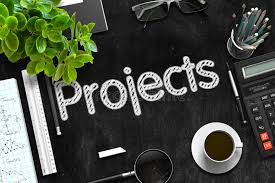

# Project1 - Document
## Hi My Name is **Bahaa Al-deen**

[Go to Live Link!](https://bahaa12edeen.github.io/Project1/)

***
## Introduction
After We Learn Set of Topics Like:

1. UI
1. HTML5
1. CSS3
1. BOOTSTRAP

WE DO IT!

Create Our Portfolio

## Project Overview

Portfolio web page contains languages we learned and projects did me do,  personal photo,  my full name, objective, Education, experience, personal information (email, phone number)

## Project Design

* We took into account that the page is responsive

1. Project Wireframe
   * [Wireframe Link](https://bahaa12edeen.github.io/Project1/mockup/wirframe-#1.pdf)

1. Project Mockup
   * [Mockup Link](https://bahaa12edeen.github.io/Project1/mockup/mockup-#1.pdf)

1. Project Folder
   * [Folder Link](https://github.com/bahaa12edeen/Project1.git)

1. Live Code
   * [Live Link](https://bahaa12edeen.github.io/Project1/)